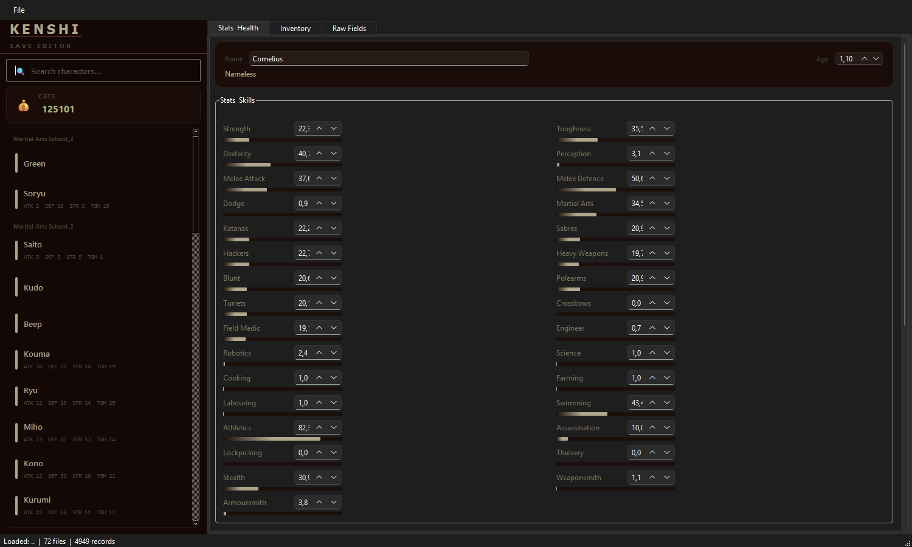

<p align="center">
  
</p>

<h1 align="center">
  <br>
  ⚔️ Kenshi Save Editor
  <br>
</h1>

<p align="center">
  <b>A powerful desktop save editor for <a href="https://store.steampowered.com/app/233860/Kenshi/">Kenshi</a> with an authentic game-styled UI</b>
</p>

<p align="center">
  
  
  
  
  
</p>

<p align="center">
  <a href="#-features">Features</a> •
  <a href="#-screenshots">Screenshots</a> •
  <a href="#-installation">Installation</a> •
  <a href="#-usage">Usage</a> •
  <a href="#%EF%B8%8F-architecture">Architecture</a> •
  <a href="#-contributing">Contributing</a>
</p>

---

## ✨ Features

### 🗡️ Character Editor
- **Stats & Skills** — Edit all 30+ character stats (Strength, Toughness, Melee Attack, etc.) with visual progress bars
- **Health System** — Modify blood, hunger, and per-limb health values (HP, bandage, stun, splint)
- **Limb Status** — Toggle limbs between Attached, Severed, and Prosthetic
- **Name & Age** — Quick inline editing with faction display

### 🎒 Inventory Editor
- View and edit all equipped and carried items
- Modify quantity, quality, charges, and slot assignment
- Automatic item name resolution from game data files

### ⚖️ Faction Relations
- Full faction relations table with editable Relation, Trust, and Trust Negative values
- Auto-resolves faction IDs to human-readable names from `gamedata.base` and mods

### 💰 Money Editor
- Always-visible Cats (currency) editor in the sidebar
- Supports values up to 2 billion

### 🔧 Raw Record Editor
- Browse and edit every field type: Bool, Float, Int, Vec3, Vec4, String, File, References
- Tabbed interface with field counts per type
- Works on any record type (characters, towns, world state, etc.)

### 🎨 Authentic Kenshi Theme
- Colors extracted from the game's own `kenshi_colours.xml`
- Ships with **Exo 2** and **Sentencia** — Kenshi's actual UI fonts
- Dark warm-brown palette matching the game's post-apocalyptic aesthetic

### 🔍 Smart Features
- **Auto-detect Kenshi install** via Steam library folders (including multiple Steam libraries)
- **Mod support** — Resolves names from `.mod` files and Steam Workshop mods
- **Search** — Filter characters by name in the sidebar
- **Backup** — One-click save backup with timestamped folders
- **Save As** — Export modified saves to a different location

---

## 📸 Screenshots

<p align="center">
  
  <br>
  <em>Character stats editor with Kenshi-authentic UI theme</em>
</p>

---

## 📦 Installation

### Prerequisites
- **Python 3.10+**
- **Kenshi** (Steam version — for game data resolution)

### Quick Setup

```bash
# Clone the repository
git clone https://github.com/wansolanso/Kenshi-Save-Editor.git
cd kenshi-save-editor

# Create virtual environment
python -m venv venv

# Activate (Windows)
venv\Scripts\activate

# Install dependencies
pip install -r requirements.txt
```

### Dependencies
| Package | Version | Purpose |
|---------|---------|---------|
| PyQt6   | ≥ 6.6   | GUI framework |

> That's it — just one dependency! Everything else is Python standard library.

---

## 🚀 Usage

### Windows (recommended)
```
run.bat
```

### Command Line
```bash
# Activate virtual environment first
venv\Scripts\activate

# Launch the editor
python -m src.main

# Open a specific save folder directly
python -m src.main "C:\Users\YourUser\AppData\Local\kenshi\save\MySave"
```

### Workflow

1. **Open** — `Ctrl+O` → Navigate to your save folder (usually `%LOCALAPPDATA%\kenshi\save\<save_name>`)
2. **Edit** — Select a character, faction, or record from the sidebar
3. **Modify** — Change stats, inventory, relations, or any raw field
4. **Backup** — `File → Create Backup` (recommended before saving)
5. **Save** — `Ctrl+S` to write changes back

### Keyboard Shortcuts

| Shortcut | Action |
|----------|--------|
| `Ctrl+O` | Open save folder |
| `Ctrl+S` | Save modified files |
| `Ctrl+Shift+S` | Save As (different location) |
| `Ctrl+Q` | Quit |

---

## ⚙️ Architecture

```
kenshi-save-editor/
├── src/
│   ├── main.py              # MainWindow, app entry point
│   ├── binary_parser.py     # OCS binary format read/write (round-trip safe)
│   ├── models.py            # Data classes: Record, SaveFile, Header, Instance
│   ├── save_manager.py      # File loading, modification tracking, backup
│   ├── game_data.py         # Auto-detect Kenshi install, resolve SIDs to names
│   ├── constants.py         # Typecodes, stat names, body parts, inventory slots
│   ├── style.py             # Kenshi-authentic theme (colors, fonts, stylesheet)
│   └── widgets/
│       ├── sidebar.py       # Character list, search, money editor
│       ├── character_editor.py  # Stats, health, limbs
│       ├── inventory_editor.py  # Item table editor
│       ├── faction_editor.py    # Faction relations table
│       ├── record_editor.py     # Generic raw field editor
│       └── record_tree.py       # Tree view for browsing records by type
├── requirements.txt
├── run.bat
└── test_fac.py
```

### Binary Format

Kenshi saves use the **OCS (Object Component System)** binary format:

```
[Header: filetype(4) | next_id(4) | record_count(4)]
[Record 1]
  ├── raw_instance_count(4) | typecode(4) | record_id(4)
  ├── name(str) | string_id(str) | save_data(4)
  ├── bool_fields[count → key(str) + val(1)]
  ├── float_fields[count → key(str) + val(4)]
  ├── int_fields[count → key(str) + val(4)]
  ├── vec3_fields[count → key(str) + xyz(12)]
  ├── vec4_fields[count → key(str) + xyzw(16)]
  ├── string_fields[count → key(str) + val(str)]
  ├── file_fields[count → key(str) + val(str)]
  ├── reference_categories[count → name(str) + refs[...]]
  └── instances[count → sid(str) + target(str) + pos(12) + rot(16) + states[...]]
[Record 2...]
[Tail data (quick.save only)]
```

All integers are **little-endian**. Strings are **length-prefixed** (4-byte int + UTF-8 bytes).

### Key Record Types

| Typecode | Name | Description |
|----------|------|-------------|
| 36 | `GAMESTATE_CHARACTER` | Player and NPC characters |
| 37 | `GAMESTATE_FACTION` | Faction data with inter-faction relations |
| 25 | `CHARACTER_STATS` | All 30+ combat and crafting skills |
| 42 | `INVENTORY_ITEM_STATE` | Items in inventory slots |
| 57 | `MEDICAL_STATE` | Per-limb health, blood, hunger |
| 34 | `PLATOON` | Squad/platoon groupings |
| 38 | `GAMESTATE_TOWN` | Town ownership and state |
| 56 | `MAP_FEATURES` | World map data, player money |

---

## 🔒 Safety

- **Non-destructive** — The editor preserves all unknown fields and tail data for exact round-trip fidelity
- **Backup system** — Built-in one-click backup with timestamps
- **Confirmation prompts** — Saves require explicit confirmation
- **No auto-save** — Changes are only written when you press `Ctrl+S`

> ⚠️ **Always create a backup before editing your saves.** While the editor is designed for round-trip safety, save editing is inherently risky.

---

## 🤝 Contributing

Contributions are welcome! Here are some areas that could use improvement:

- [ ] Zone file loading (`.zone` / `.hkt` files)
- [ ] Character appearance editing
- [ ] AI state editing
- [ ] Research state editing
- [ ] Item duplication / creation
- [ ] Undo/redo system
- [ ] Cross-platform support (Linux/macOS)

### Development Setup

```bash
git clone https://github.com/wansolanso/Kenshi-Save-Editor.git
cd kenshi-save-editor
python -m venv venv
venv\Scripts\activate
pip install -r requirements.txt
python -m src.main
```

---

## 🔏 Code Signing Policy

Free code signing provided by [SignPath.io](https://signpath.io), certificate by [SignPath Foundation](https://signpath.org).

**Team roles:**
- Committers and reviewers: [Members](https://github.com/orgs/wansolanso/people)
- Approvers: [Repository owner](https://github.com/wansolanso)

**Privacy policy:** This program will not transfer any information to other networked systems unless specifically requested by the user or the person installing or operating it. The only network request is an optional update check to the GitHub API (`api.github.com`) which can be declined by the user.

---

## 📄 License

[MIT License](LICENSE) — This project is open source. Kenshi is a registered trademark of Lo-Fi Games.

---

<p align="center">
  Made with ⚔️ for the Kenshi community
</p>
